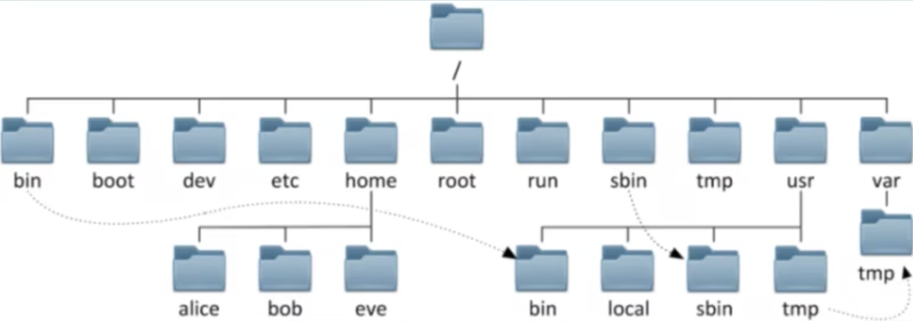

# 用户与文件管理

## linux 目录结构
linux以单根的方式组织文件：/



一级目录 `/`
二级目录：
1. bin    执行命令
2. boot   启动目录
3. dev    驱动（device）
4. etc    配置文件、控制台文件
5. home   用户文件
6. root   超级管理员目录，一般用户没有权限
7. run    运行目录，临时
8. sbin   与`bin`类似，是超管的命令
9. tmp    临时目录
10. usr   应用程序，一般将安装的程序放在这里
    1.  bin
    2.  local
    3.  sbin
    4.  tmp
11. var   与 temp run 类似

## 文件管理

### 文件类型
ls -l 输出文件详细信息
第一个属性为`-`代表普通文件，`d`代表目录

### 文件管理命令
1. ls 列出目录内容
   -l 详细信息
2. cd 跳转到目录（change directory)
3. pwd    获取当前路径
4. touch  创建文件
5. mkdir  创建目录
   -p 多级创建
6. cp     复制文件
   -r   递归复制
7. mv   移动文件
8. rm   删除文件
   -rf  强制递归
9. 查看文件内容
   1.  cat  全部
   2.  more 翻页
   3.  head 头部
   4.  tail 尾部

## 用户与组
### 用户/组的基本概念
### 用户信息的存储文件
1. 用户基本信息文件
   ```bash
   car /etc/passwd
   ```
   |用户名|密码|uid|gid|描述|HOME|shell|
   |-|-|-|-|-|-|-|
   |root|x|0|0|root|/root|/usr/local/bin/zsh|

   - 用户名：字母和数字，不可重名
   - 密码
   - uid：用户身份
          0: 特权用户
          1～499: 系统用户
          1000+：普通用户
   - gid：组ID
   - 描述：
   - HOME：登录时所在目录
   - shell：命令解释器
2. 用户密码信息文件
   `etc/shadow`
   |用户名|密文密码|上次修改时间（相对天数）|最小间隔（多少天可以改密码）|最大时间间隔（密码有效期）|警告时间|不活动时间(不登陆禁用)|失效时间（到期禁用）|
   |-|-|-|-|-|-|-|-|
   |root|$1$CyNxFEtY$K5VO7hD19OpGkpNEFPf390|19282|0|99999|7||||  
3. 组信息文件
   `/etc/group`
   |组名|组密码|组ID|组成员|
   |-|-|-|-|
   |root|x|0| |

### 用户/组管理
1. 创建用户 未指定选项
   ```bash
   # 使用 useradd 命令创建用户
   useradd user1

   grep user1 /etc/passwd
   # user1:x:1001:1001::/home/user1:/bin/bash

   # id 命令查看用户信息
   id user1
   # uid=1001(user1) gid=1001(user1) groups=1001(user1) 

   # passwd 命令修改密码
   passwd user1

   # /var/spool/mail/user1 是用户的邮件

   ```
2. 创建用户 指定选项
    ```bash
    # -u 指定uid
    # -d 指定HOME
    useradd user2 -u 1503 -d /home/user2home
    # man useradd or useradd --help 查看所有参数
    ```
3. 删除用户
   ```bash
   # userdel 
   userdel user2
   ```
4. 用户密码
   root用户可以修改其他用户的密码，普通用户只能修改自己的密码
   用户可以自己登录修改密码
5. 组成员管理
   使用组来管理具有一类权限的用户
   ```bash
   # groupadd 新建用户组
   groupadd gp1

   # 修改组的基本信息
   groupmod 

   # 查看组信息
   grep 'gp1' /etc/group

   # 删除
   groupdel gp1

   # 将用户添加到组
   usermod -a gp1

   # 将用户从组中移除
   gpasswd -d user group
   ```
   - 组分类
     - 基本组：随用户而创建的组，组名同用户名，基本组只能有一个，基本组信息保存在`/etc/passwd`
     - 附加组：用户所在的非其基本组就是用户的附加组，可以有多个，附加组保存在`/etc/group`
6. 其他选项管理
   ```bash
    # usermod 修改用户属性
    usermod -s /bin/nologin user2
   ```
7. 提权
   1. 永久提权
      ```bash
      # 切换到root  或其他用户
      su - root

      # su 不加 - ，环境变量不变，还在之前的目录
      su - user1
      su user2
      # 第一行切换用户为user1,执行了下面的脚本:
      /etc/profile
      /etc/bashrc
      ~/.bash_profile
      ~/.bashrc
      # 第二行 不加 - 切换的话只执行两个文件:
      /etc/bashrc
      ~/.bashrc

      # 退出
      exit
      ```
      切换需身份要密码
   2. 临时提权
      ```bash
      # sudo 命令
      # 将当前用户切换为root
      # 然后用root执行命令，执行完成后退回原来用户
      # 具体过程：
      # 当用户执行 sudo 时，系统会寻找/etc/sudoers文件，判断该用户是否具备权限
      # -》具备权限，输入密码 -》 密码正确，执行命令

      # 配置格式
      用户/组  位置  命令 # 参考 /etc/sudoers

      # 一般将用户加入 wheel 组
      ```

# 用户的权限
## 基本权限UGO
### 设置权限的两个基本元素
1. 权限对象
   1. 属主：U
   2. 属组：G
   3. 其他人：O
   4. 特殊对象：A（所有人）（u+g+o）
2. 权限类型
   1. 读：r=4
   2. 写：w=2
   3. 执行：x=1

#### 查看权限
```bash
ll file # ll 命令
drwxr-xr-x   2 root root 48 2013-11-27 16:34 test/

第一个字母表示文件类型,
   ”-”,普通文件.
   ”d”目录,字母”d”,是dirtectory(目录)的缩写.
   “l”符号链接。请注意,一个目录或者说一个文件夹是一个特殊文件,这个特殊文件存放的是其他文件和文件夹的相关信息.
   “b”块设备文件。
   “c”字符设备文件
紧接着的3*3个字符分3组，各指示此文件的读、写、执行权限，对于owner、group、others而言
第二个栏位，表示文件个数。如果是文件的话，那这个数目自然是1了，如果是目录的话，那它的数目就是该目录中的文件个数了
第三个栏位，表示该文件或目录的拥有者。若使用者目前处于自己的Home,那这一栏大概都是它的账号名称
第四个栏位，表示所属的组（group）
大小
最近修改时间
名称

```

#### 设置权限
1. 更改权限
   ```bash
   # chmod (change modify 更改设置)
   chmod   u+r   ./1.txt
   #       权限   文件或目录
   ```
   1. 使用符号
      ```bash
      # +  添加权限 
      # -  移除权限
      # =  权限置为

      chmod u=rwx, g+w, o-w name
      ```
   2. 使用数字
      ```bash
      # r - 4,  w - 2,  x - 1,  null - 0
      chmod 777 name
      ```
#### 更改属主、属组
1. chown
   更改属主
   ```bash
   chown user1.gp1    file
   #     用户名.组名  文件
   # 也可以只改属主或属组
   chown user1 file
   chown .gp1 file
   ```
2. chgrp
   更改属组
   ```bash
   chgrp gp1 file
   ```

## 基本权限ACL
## 特殊权限
